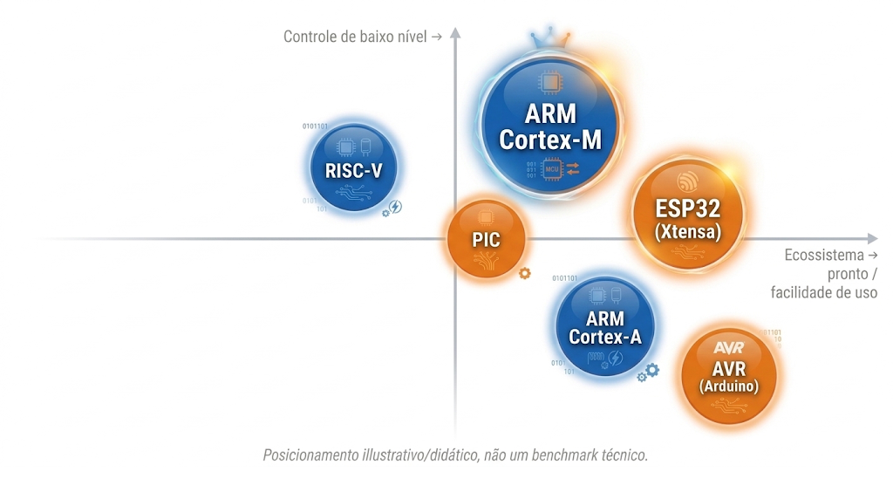
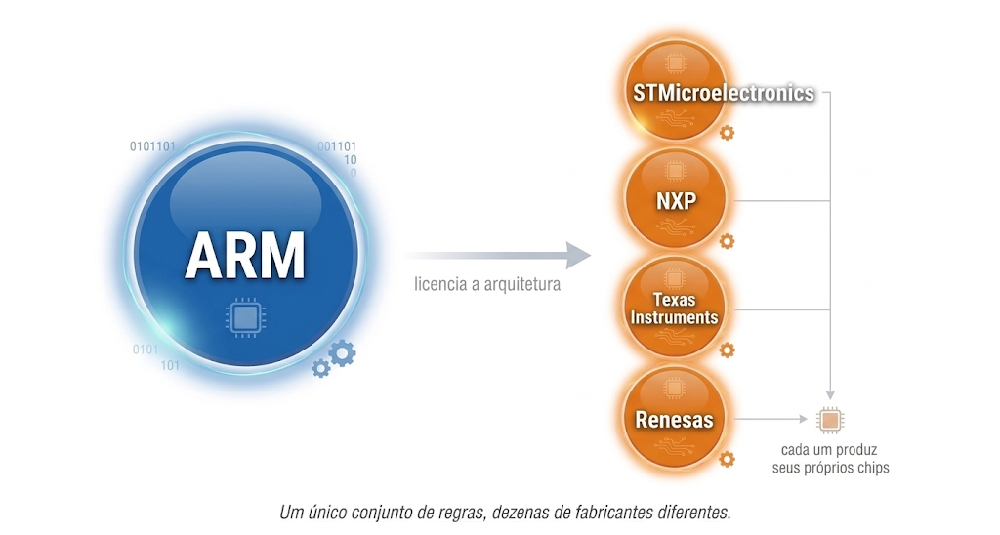

# Apresentação {.unnumbered}

Bem-vindo à disciplina de Sistemas Embarcados I. Este curso foi concebido para proporcionar uma experiência **teórico-prática completa**, garantindo que, ao final da jornada, você possua o **domínio técnico e a autonomia necessários para projetar e desenvolver sistemas embarcados do início ao fim**, integrando plenamente hardware e firmware.

O grande diferencial desta disciplina está na abordagem sistêmica: você aprenderá a projetar o **hardware** — incluindo esquemas eletrônicos e o design de PCBs — em conjunto com o desenvolvimento do **firmware**, elaborando o código de baixo nível que dá vida ao sistema. Dessa forma, você compreenderá a essência dessas tecnologias, desde seus fundamentos físicos e lógicos até a implementação de soluções robustas em dispositivos de alta complexidade.

::: {.text-center}
{width="70%" fig-align="center"}
:::

Para alcançar esse nível de proficiência, utilizaremos a metodologia **Bottom-Up** (de baixo para cima). Nesta metodologia, o aprendizado é construído em etapas evolutivas, onde cada fase resolve um desafio técnico real e introduz um novo nível de sofisticação. Nesta abordagem, **não utilizamos "caixas pretas"**. Em vez disso, cada componente do sistema é compreendido em sua totalidade, desde os circuitos eletrônicos e o design de hardware até a programação de baixo nível e a integração de sistemas. A cada etapa, você enfrentará desafios técnicos reais, como a implementação de um driver para um periférico específico ou a otimização do consumo de energia, garantindo que o aprendizado seja prático, relevante e alinhado com as demandas do mercado.

::: {.text-center}
{width="70%" fig-align="center"}
:::

Frameworks de abstração como o **Arduino**, a **HAL (Hardware Abstraction Layer)** da ST ou o **ESP-IDF** da Espressif são ferramentas legítimas e amplamente utilizadas na indústria e na prototipagem — inclusive por engenheiros experientes, quando produtividade importa mais do que controle fino. Todos eles aceleram o desenvolvimento ao encapsular a complexidade do hardware em funções de alto nível, como `delay()`, `HAL_GPIO_WritePin()` ou os drivers do IDF, que mascaram o funcionamento real de timers e registradores. Nesta disciplina, no entanto, a ordem é invertida: nosso foco é a transparência total desde a base. Aqui, você não utilizará funções de temporização ou bibliotecas prontas sem antes dominar o hardware e o firmware que as sustentam, compreendendo exatamente como os periféricos interagem com o núcleo do processador — para que, se um dia optar por usar essas abstrações, seja por escolha consciente, e não por depender de uma caixa preta.

Essa metodologia permite vivenciar os desafios reais da engenharia, como a gestão otimizada de recursos limitados, a depuração em nível de hardware e a criação de interfaces que unem eficiência e manutenibilidade. Ao escalar cada camada da arquitetura, você compreenderá a fundamentação técnica por trás de cada decisão de design, transformando a complexidade em um processo de desenvolvimento lógico, estruturado e profissional.

## Arquitetura e plataformas para sistemas embarcados

É bem provável que você já tenha alguma experiência com **Arduino** ou **ESP32** — são, hoje, a porta de entrada mais comum para eletrônica e programação de microcontroladores, e por bons motivos: são baratos, acessíveis e têm um ecossistema gigante de bibliotecas prontas. Mas eles são só dois pontos em um universo bem mais amplo de arquiteturas disputando esse espaço:

* **Microcontroladores de 8 bits** — a família **AVR** (o chip por trás do Arduino Uno clássico) e o **PIC** da Microchip. Simples, baratos, com décadas de mercado consolidado, mas limitados em desempenho, memória e periféricos para aplicações mais exigentes.
* **RISC-V** — uma arquitetura de conjunto de instruções *aberta* (sem custo de licenciamento), crescendo rápido na indústria, mas ainda com ecossistema de ferramentas e depuração menos maduro que os concorrentes estabelecidos.
* **Xtensa** — o núcleo proprietário da Espressif, usado no **ESP32**. Seu grande diferencial é a conectividade Wi-Fi/BLE já integrada ao chip, o que o tornou o queridinho de projetos de IoT.
* **ARM Cortex-M** — a linha de núcleos ARM desenhada especificamente para microcontroladores (diferente do Cortex-A, que equipa smartphones e computadores rodando sistemas operacionais completos).

::: {.text-center}
{width="85%" fig-align="center"}
:::

### A arquitetura ARM Cortex-M

A **ARM** não é um chip — é uma *arquitetura de processador*: um conjunto de regras de design que a empresa britânica ARM Holdings licencia para fabricantes de semicondutores, que então produzem seus próprios chips seguindo essas regras. É por isso que STMicroelectronics, NXP, Texas Instruments e Renesas competem entre si vendendo chips completamente diferentes, mas todos com núcleo ARM por dentro. Dentro da família ARM, o **Cortex-M** é a linha voltada a microcontroladores: chips pequenos, de baixo consumo, que rodam sem sistema operacional e controlam diretamente o hardware. Um **STM32**, por exemplo — a família de chips que utilizaremos no curso — é um microcontrolador da ST construído sobre um núcleo Cortex-M.

::: {.text-center}
{width="85%" fig-align="center"}
:::

Este curso é fundamentado nessa arquitetura, o padrão *de facto* na indústria global de tecnologia. A escolha não é apenas uma decisão pedagógica, mas um alinhamento estratégico com as demandas reais do mercado de engenharia:

* **Liderança Absoluta de Mercado:** Com um ecossistema que movimenta mais de **30 bilhões de chips anualmente**, a arquitetura ARM sustenta cerca de **90% dos dispositivos móveis do mundo** e é a espinha dorsal da eletrônica automotiva e industrial moderna. Estudar ARM é aprender a tecnologia que move o planeta.

* **Controle Profissional vs. Prototipagem (ARM vs. Arduino/AVR):** o Arduino é uma excelente porta de entrada para o hobby, mas o ARM Cortex-M oferece os recursos exigidos em produtos comerciais de alta performance. Aqui, exploramos o controle total sobre o hardware através do acesso direto a **registradores, DMA e gerenciamento avançado de energia**, competências essenciais para o desenvolvimento de produtos otimizados e escaláveis — e que o Arduino, por design, esconde do programador.

* **Determinismo e Confiabilidade (ARM vs. ESP32):** o ESP32 é uma ferramenta poderosa para IoT, mas a linha ARM (como os STM32) oferece um ecossistema de **depuração (Debug) profissional via SWD/JTAG** incomparável. Isso permite ao engenheiro analisar o ciclo de instrução e garantir o determinismo temporal em sistemas críticos, onde falhas de milissegundos não são uma opção — algo que a pilha de conectividade do ESP32 não foi projetada para priorizar.

* **Versatilidade e Independência de Fabricante:** dominar o conjunto de instruções e a arquitetura ARM permite que você transite livremente entre os maiores fabricantes de semicondutores do mundo (**STMicroelectronics, NXP, Texas Instruments, Renesas**). Você não aprende a programar um chip específico, mas sim a arquitetura que define o padrão global da engenharia de sistemas embarcados — logo, tudo o que aprender aqui permanece válido mesmo se, amanhã, seu empregador utilizar outro fabricante.

::: {.text-center}
{width="70%" fig-align="center"}
:::

## Metodologia de Avaliação

A avaliação da disciplina acompanha a progressão *bottom-up* do curso: cada módulo temático se encerra com uma **atividade prática avaliativa**, e o semestre se encerra com um **projeto integrador**, no qual você deverá combinar conhecimentos de hardware e firmware desenvolvidos ao longo de todo o curso.

A composição da nota segue a estrutura institucional em dois bimestres:

| Instrumento | Peso | Observação |
|---|:---:|---|
| Prova 1 | 30 pts | Referente aos módulos do 1º bimestre |
| Trabalho 1 (atividades de módulo) | 20 pts | Atividades práticas de fechamento de módulo |
| Prova 2 | 30 pts | Referente aos módulos do 2º bimestre |
| Trabalho 2 (projeto integrador) | 20 pts | Projeto final, integrando hardware e firmware |
| Lista de recuperação | até 20 pts extra | Pontuação de recuperação, conforme calendário da disciplina |

: {tbl-colwidths="[35,15,50]"}

> **Nota:** esta distribuição está em fase de ajuste conforme a disciplina é reestruturada em torno das atividades de módulo. O detalhamento de cada atividade (enunciado, critérios de correção e prazos) será publicado no capítulo de cada módulo.

## Cronograma

O curso está organizado em **5 módulos**, distribuídos ao longo de 15 semanas, seguindo estritamente a progressão bottom-up: cada módulo depende do domínio do anterior.

| Módulo | Semanas | Tema | Atividade de fechamento |
|:---:|:---:|---|---|
| 1 | 1–3 | Fundamentos e Toolchain (arquitetura de computadores, ARM, boot, linker, Makefile) | Startup + linker script próprios |
| 2 | 4–6 | Clocks e GPIO (RCC, barramentos AHB/APB, EXTI, NVIC) | Driver de GPIO com interrupção |
| 3 | 7–9 | Temporização e Comunicação Serial (Timers, PWM, UART) | Controle via UART/PWM |
| 4 | 10–12 | Barramentos de Sensor e DMA (SPI, I2C, ADC) | Aquisição de sensor via DMA |
| 5 | 13–15 | Baixo Consumo, Hardware e Projeto Integrador | Projeto integrador (entrega final) |

: {tbl-colwidths="[8,10,52,30]"}

O detalhamento semana a semana, com objetivos de aprendizagem específicos, está disponível no [Sumário do Curso](pt-br/contents.qmd). Os pré-requisitos de ambiente, as ferramentas utilizadas e as referências bibliográficas são específicos de cada módulo e estão detalhados na abertura do respectivo capítulo.

 

::: {.text-center .mt-5}
[Iniciar Conteúdo da Disciplina](pt-br/contents.qmd){.btn .btn-primary .btn-lg .btn-language role="button"}
:::
