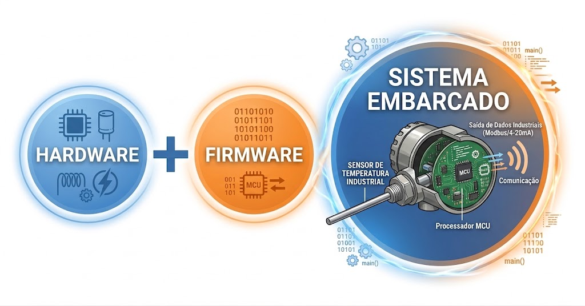
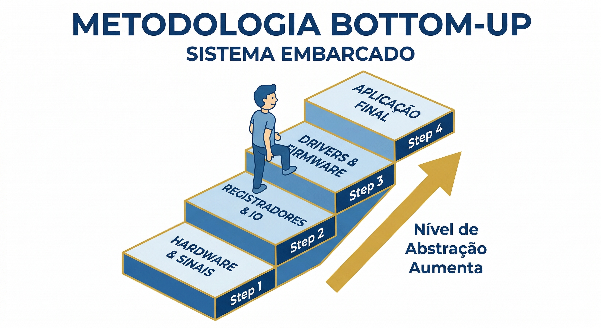
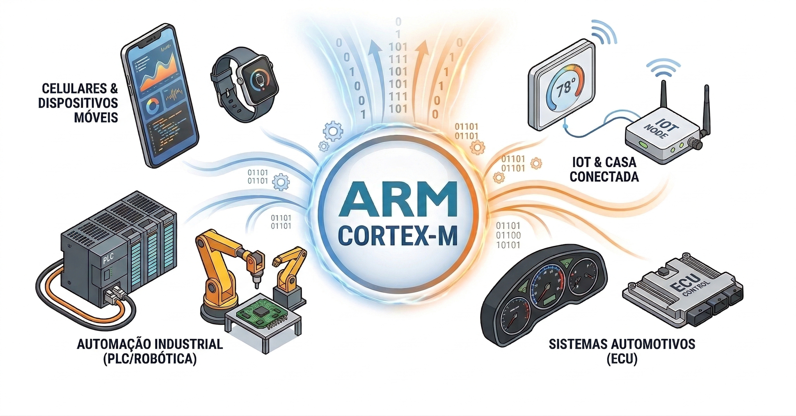
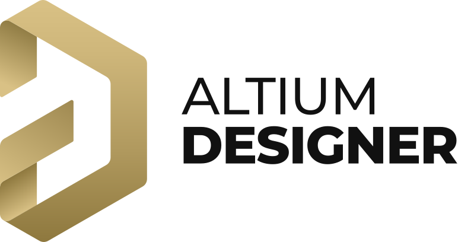
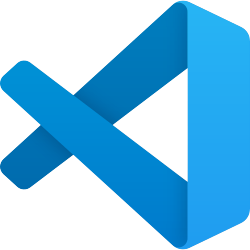

::: {.landing-container}
::: {.content-wrapper}

## Introdução {.unnumbered}

Bem-vindo à disciplina de Sistemas Embarcados I. Este curso foi concebido para proporcionar uma experiência **teórico-prática completa**, garantindo que, ao final da jornada, você possua o **domínio técnico e a autonomia necessários para projetar e desenvolver sistemas embarcados do início ao fim**, integrando plenamente hardware e firmware.

O grande diferencial desta disciplina está na abordagem sistêmica: você aprenderá a projetar o **hardware** — incluindo esquemas eletrônicos e o design de PCBs — em conjunto com o desenvolvimento do **firmware**, elaborando o código de baixo nível que dá vida ao sistema. Dessa forma, você compreenderá a essência dessas tecnologias, desde seus fundamentos físicos e lógicos até a implementação de soluções robustas em dispositivos de alta complexidade.

::: {.text-center}
{width="70%" fig-align="center"}
:::

Para alcançar esse nível de proficiência, utilizaremos a metodologia **Bottom-Up** (de baixo para cima). Nesta metodologia, o aprendizado é construído em etapas evolutivas, onde cada fase resolve um desafio técnico real e introduz um novo nível de sofisticação. Nesta abordagem, **não utilizamos "caixas pretas"**. Em vez disso, cada componente do sistema é compreendido em sua totalidade, desde os circuitos eletrônicos e o design de hardware até a programação de baixo nível e a integração de sistemas. A cada etapa, você enfrentará desafios técnicos reais, como a implementação de um driver para um periférico específico ou a otimização do consumo de energia, garantindo que o aprendizado seja prático, relevante e alinhado com as demandas do mercado.

::: {.text-center}
{width="70%" fig-align="center"}
:::

Diferente da plataforma Arduino, que agiliza o desenvolvimento ao esconder a complexidade do hardware através de abstrações de alto nível — como as funções *delay()* ou *millis()* que mascaram o funcionamento real dos timers e registradores — nosso foco é a transparência total. Aqui, você não utilizará funções de temporização ou bibliotecas prontas sem antes dominar o hardware e o firmware que as sustentam, compreendendo exatamente como os periféricos interagem com o núcleo do processador.

Essa metodologia permite vivenciar os desafios reais da engenharia, como a gestão otimizada de recursos limitados, a depuração em nível de hardware e a criação de interfaces que unem eficiência e manutenibilidade. Ao escalar cada camada da arquitetura, você compreenderá a fundamentação técnica por trás de cada decisão de design, transformando a complexidade em um processo de desenvolvimento lógico, estruturado e profissional.

O curso é fundamentado na arquitetura **ARM Cortex-M**, o padrão *de facto* na indústria global de tecnologia. A escolha desta plataforma não é apenas uma decisão pedagógica, mas um alinhamento estratégico com as demandas reais do mercado de engenharia:

* **Liderança Absoluta de Mercado:** Com um ecossistema que movimenta mais de **30 bilhões de chips anualmente**, a arquitetura ARM sustenta cerca de **90% dos dispositivos móveis do mundo** e é a espinha dorsal da eletrônica automotiva e industrial moderna. Estudar ARM é aprender a tecnologia que move o planeta.

* **Controle Profissional vs. Prototipagem (ARM vs. Arduino):** Enquanto plataformas como o Arduino (AVR) são excelentes portas de entrada para o hobby, o ARM Cortex-M oferece os recursos exigidos em produtos comerciais de alta performance. Aqui, exploramos o controle total sobre o hardware através do acesso direto a **registradores, DMA e gerenciamento avançado de energia**, competências essenciais para o desenvolvimento de produtos otimizados e escaláveis.

* **Determinismo e Confiabilidade (ARM vs. ESP32):** Embora o ESP32 seja uma ferramenta poderosa para IoT, a linha ARM (como os STM32) oferece um ecossistema de **depuração (Debug) profissional via SWD/JTAG** incomparável. Isso permite ao engenheiro analisar o ciclo de instrução e garantir o determinismo temporal em sistemas críticos, onde falhas de milissegundos não são uma opção.

* **Versatilidade e Independência de Fabricante:** Dominar o conjunto de instruções e a arquitetura ARM permite que transite livremente entre os maiores fabricantes de semicondutores do mundo (**STMicroelectronics, NXP, Texas Instruments, Renesas**). Você não aprende a programar um chip específico, mas sim a arquitetura que define o padrão global da engenharia de sistemas embarcados.

::: {.text-center}
{width="70%" fig-align="center"}
:::

:::
:::

::: {.landing-container}
::: {.content-wrapper}

## Ecossistema de Desenvolvimento

Para as atividades práticas, utilizaremos ferramentas profissionais que priorizam o controle total sobre o ciclo de desenvolvimento e a visibilidade direta do hardware. Essas ferramentas permitem que você tenha acesso detalhado a cada etapa do processo, desde o projeto inicial do circuito até a programação e depuração do firmware, proporcionando uma compreensão profunda dos mecanismos internos do sistema.

Ao optar por ambientes de desenvolvimento avançados — como editores extensíveis, toolchains profissionais e depuradores de baixo nível — é possível analisar o funcionamento dos periféricos, monitorar o estado interno do processador e identificar possíveis gargalos de desempenho, tudo em tempo real diretamente no hardware real. Assim, você estará preparado para enfrentar situações reais de engenharia, ajustando parâmetros, otimizando recursos e implementando soluções robustas. O uso dessas ferramentas profissionais também favorece a colaboração em projetos complexos, facilitando a documentação do processo e a integração entre equipes multidisciplinares. Dessa maneira, garantimos que o aprendizado seja não apenas prático, mas também alinhado com as exigências do mercado e com os padrões de qualidade internacional.

### Ferramentas para Projeto de Hardware

O desenvolvimento de hardware moderno é indissociável das ferramentas **EDA** (*Electronic Design Automation*). Estes ecossistemas automatizam a transição entre o conceito teórico e a implementação física, sendo indispensáveis para projetar, simular e validar esquemas eletrônicos com rigor técnico. Através de recursos avançados — como a verificação de regras elétricas (**ERC**) e de layout (**DRC**), visualização 3D e exportação de arquivos Gerber — as ferramentas **EDA** garantem que o layout da **PCB** possua a precisão necessária para a fabricação industrial. O domínio destas ferramentas é o que permite transformar circuitos complexos em produtos funcionais e confiáveis, assegurando a integração perfeita entre o hardware e o firmware em projetos de sistemas embarcados.

Para colocar esses conceitos em prática, poderemos utilizar ferramentas que abrangem desde o ecossistema open-source até ferramentas que atendem aos padrões mais elevados da indústria. O **KiCad** será nossa base para o aprendizado de design de **PCBs**, oferecendo uma plataforma robusta e sem restrições de licenciamento. Para projetos que exigem uma integração profunda entre a eletrônica e o design mecânico, exploraremos o **Autodesk Fusion 360**, enquanto o **Altium Designer** se apresenta como uma solução de ponta para roteamento avançado e fluxos de trabalho profissionais. Cada uma dessas ferramentas tem suas vantagens e desvantagens, e a escolha entre elas dependerá do contexto do projeto, dos requisitos técnicos e das preferências pessoais. O importante é que, independentemente da ferramenta escolhida, o foco estará sempre na compreensão profunda dos princípios de design de hardware e na capacidade de criar soluções eficientes e escaláveis para sistemas embarcados.

::: {.content-card}
#### **KiCad EDA**

::: {.grid}
::: {.g-col-12 .g-col-md-3 .text-center}

:::

::: {.g-col-12 .g-col-md-9}
* **Vantagens:** Totalmente *open-source*, sem custos de licenciamento e com uma comunidade global vibrante. Possui um gerenciador de bibliotecas flexível e não impõe restrições ao tamanho da placa.
* **Desvantagens:** Interface pode parecer menos intuitiva para quem vem de ferramentas comerciais; recursos de simulação nativa e roteamento interativo são menos avançados que soluções de ponta.
:::
:::
:::

::: {.content-card}
#### **Autodesk Fusion 360**

::: {.grid}
::: {.g-col-12 .g-col-md-3 .text-center}

:::

::: {.g-col-12 .g-col-md-9}
* **Vantagens:** Integração nativa incomparável entre o design eletrônico (ECAD) e o design mecânico (MCAD). Excelente visualização 3D e facilidade para projetar gabinetes e caixas.
* **Desvantagens:** Modelo de assinatura (licença gratuita limitada para estudantes); forte dependência de processamento em nuvem e conexão estável com a internet.
* **Atenção:** Estudantes universitários podem acessar o **Autodesk Fusion 360 Education License**, que oferece uma licença gratuita de um ano (renovável) para uso acadêmico, garantindo acesso a todas as funcionalidades avançadas da plataforma.
:::
:::
:::

::: {.content-card}
#### **Altium Designer**

::: {.grid}
::: {.g-col-12 .g-col-md-3 .text-center}

:::

::: {.g-col-12 .g-col-md-9}
* **Vantagens:** O padrão ouro da indústria. Possui ferramentas de roteamento interativo extremamente poderosas, gerenciamento avançado de regras de design (DRC) e é focado em produtividade para projetos profissionais de alta complexidade.
* **Desvantagens:** Custo de licenciamento elevado; exige hardware potente para execução fluida; curva de aprendizado mais íngreme para dominar todas as funcionalidades avançadas.
* **Atenção:** Através do programa **Altium Student License**, estudantes universitários podem solicitar uma **licença educacional gratuita de seis meses (renovável)**, garantindo acesso à mesma tecnologia utilizada pelas grandes empresas.
:::
:::
:::

### Ferramentas para Desenvolvimento de Firmware

O desenvolvimento de firmware para sistemas embarcados exige o uso de ferramentas específicas que facilitam a criação, compilação e depuração do código. Em nossa disciplina, evitaremos o uso de IDEs proprietárias — como o STM32CubeIDE e até mesmo de plugins de configuração automática, como o novo STM32 VS Code Extension. Optamos por este caminho para garantir que você não dependa de geradores de código automáticos que escondem a complexidade do hardware. Ao configurar seu próprio ambiente, você compreende exatamente como o linker script, os arquivos de inicialização e os scripts de depuração funcionam, tornando seu conhecimento portável para qualquer outra arquitetura ou fabricante. A instalação e a configuração detalhada de cada um desses componentes, bem como a integração entre eles para formar um ambiente de desenvolvimento funcional, serão temas das nossas atividades práticas.

::: {.content-card}
#### **Visual Studio Code**

::: {.grid}
::: {.g-col-12 .g-col-md-3 .text-center}

:::

::: {.g-col-12 .g-col-md-9}
O Visual Studio Code (VS Code) consolidou-se como o editor preferencial para o desenvolvimento de firmware moderno, substituindo IDEs proprietárias que muitas vezes são pesadas e pouco flexíveis. Seu grande trunfo reside na arquitetura extensível: através de extensões como a Cortex-Debug e o suporte nativo à linguagem C/C++, ele se transforma em uma estação de trabalho completa que integra edição, compilação e depuração em um único fluxo.

Diferente de ferramentas "clicou, funcionou", o uso do VS Code em sistemas embarcados exige que o desenvolvedor compreenda a integração entre o editor, a toolchain (GCC) e o depurador (GDB/OpenOCD). Essa transparência é pedagógica e profissional, pois permite o monitoramento detalhado de registradores, memória e periféricos em tempo real. Além disso, a integração nativa com o Git e o terminal embutido para execução de Makefiles torna o desenvolvimento ágil, organizado e totalmente alinhado com as melhores práticas da engenharia de software atual.
:::
:::
:::

::: {.content-card}
#### **GNU ARM Toolchain**

::: {.grid}
::: {.g-col-12 .g-col-md-3 .text-center}

:::

::: {.g-col-12 .g-col-md-9}
O **GNU Arm Embedded Toolchain** é o coração técnico do desenvolvimento profissional para microcontroladores ARM Cortex-M. Diferente de compiladores para desktop, ele é uma ferramenta de **compilação cruzada** (*cross-compilation*): ele roda em sua máquina *host*, mas gera código binário específico para o alvo ARM.

Diferente de ferramentas como **Keil MDK** ou **IAR Embedded Workbench**, que são ecossistemas fechados e de alto custo, a utilização da Toolchain GNU oferece:

* **Independência de Fornecedor**: Ferramentas proprietárias costumam criar dependências de arquivos de projeto e bibliotecas que "prendem" o desenvolvedor. Com o GCC, seu projeto é portável entre diferentes fabricantes (ST, NXP, TI).

* **Ausência de Restrições**: Muitas IDEs comerciais limitam o tamanho do binário (ex: limite de 32KB na versão gratuita do Keil). A toolchain GNU é totalmente gratuita e ilimitada, permitindo projetos de qualquer escala.

* **Transparência Total**: Enquanto as IDEs proprietárias utilizam "botões mágicos" para configurar o hardware, o uso do GCC nos obriga a manipular o Linker Script e os arquivos de Startup. Isso garante que você entenda exatamente onde cada byte do seu código está sendo alocado na memória Flash ou RAM.

* **Padrão de Indústria**: O arm-none-eabi-gcc é o motor por trás da grande maioria das ferramentas modernas e servidores de Integração Contínua (CI/CD), sendo o requisito padrão para engenheiros de sistemas embarcados em nível global.
:::
:::
:::

<!-- ### 🛠️ Hardware: A Linha STM32 Cortex-M4

Utilizaremos microcontroladores da família **STM32**, baseados no núcleo **ARM Cortex-M4**. Esses dispositivos oferecem periféricos complexos (DMA, ADCs de alta velocidade, Timers avançados) essenciais para sistemas de tempo real.

::: {.grid}

::: {.g-col-12 .g-col-md-4 .text-center}
{width="100%"}
:::

::: {.g-col-12 .g-col-md-4 .text-center}
{width="100%"}
:::

::: {.g-col-12 .g-col-md-4 .text-center}
{width="100%"}
:::

::: -->

<!-- ### 💻 Software: Toolchain Profissional

Afastamos o uso de IDEs fechadas em favor de um ecossistema aberto, garantindo que o conhecimento seja portável para qualquer fabricante.

* **Visual Studio Code (VS Code):** Nossa central de desenvolvimento altamente customizável.
* **GNU Arm Embedded Toolchain:** Utilizamos o compilador `arm-none-eabi-gcc` para entender como o código C se torna binário de máquina.
* **Automação (Make/CMake):** Gerenciaremos o processo de build através de scripts, eliminando a dependência de "botões mágicos" de compiladores proprietários.

---

### 🎓 Pré-requisitos e Preparação

Para garantir o sucesso nesta disciplina, os seguintes requisitos são fundamentais:

* **Pré-requisitos Formais:** Domínio de **Sistemas Digitais** e **Programação Procedimental (Linguagem C)**.
* **Recomendações:** Conhecimentos em **Circuitos Elétricos** e **Eletrônica** facilitam as etapas de design de PCB. -->

 

::: {.text-center .mt-5}
[Iniciar Conteúdo da Disciplina](pt-br/contents.html){.btn .btn-primary .btn-lg .btn-language role="button"}
:::

:::
:::