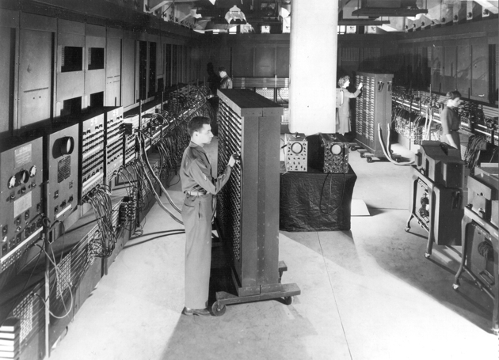
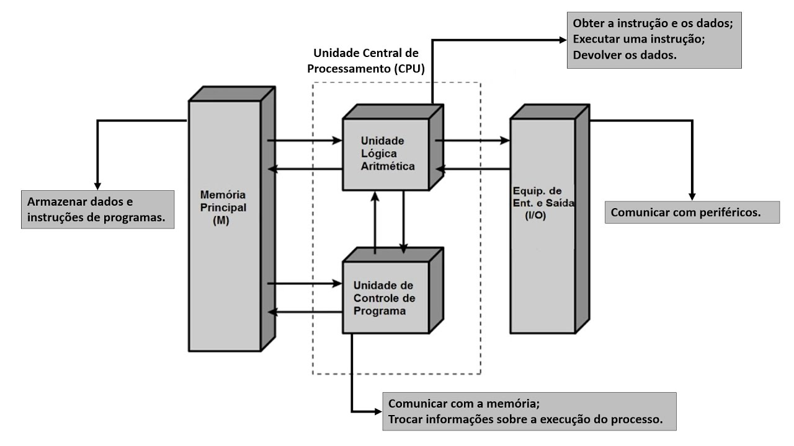
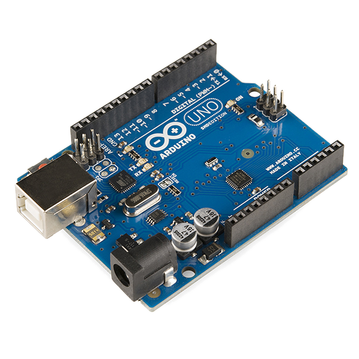

# Fundamentos de Arquitetura de Computadores

Antes de falar especificamente de ARM ou Cortex-M, vale revisar alguns conceitos fundamentais de arquitetura de computadores — eles se aplicam a qualquer processador, e vão te dar o vocabulário certo para entender as decisões de design que a ARM fez (e que vamos explorar no próximo capítulo).

## O que é Arquitetura de Computadores?

**Arquitetura de Computadores** é o projeto conceitual e a estrutura operacional fundamental de um sistema de computador. Ela define como os componentes de hardware são conectados e como trabalham juntos para executar tarefas. É comum dividir a área em três subáreas:

* **Conjunto de instruções (ISA — *Instruction Set Architecture*):** a interface entre o software e o hardware. É o "idioma" do computador — a forma como o software enxerga o hardware.
* **Organização do Computador:** trata das unidades operacionais e suas interconexões — como as partes são implementadas e conectadas. É o projeto físico e lógico de como o processador funciona internamente.
* **Implementação do Hardware:** os detalhes físicos da construção das unidades de organização (tecnologia do circuito, projeto VLSI, velocidade de clock).

Os termos "Arquitetura de Computadores" e "Organização de Computadores" são frequentemente usados de forma intercambiável, mas representam níveis de abstração distintos: a **Organização** foca na estrutura/implementação física do sistema, enquanto a **Arquitetura** foca na funcionalidade — como o sistema aparece para quem programa.

### O que define uma ISA?

A **ISA** é, na prática, um contrato: tudo que o software pode assumir que o hardware vai fazer, independentemente de como o fabricante implementou esse hardware por dentro. Um mesmo ISA pode ser implementado por chips completamente diferentes internamente — e o software continua funcionando em qualquer um deles. Uma ISA precisa especificar, entre outras coisas:

* **Conjunto de instruções:** quais operações o processador sabe executar (somar, comparar, desviar, acessar memória...).
* **Formato das instruções:** como os bits de cada instrução são organizados — tamanho fixo ou variável, quantos bits para o código da operação (*opcode*) e quantos para os operandos.
* **Modelo de registradores:** quantos registradores existem, e de quantos bits cada um.
* **Tipos de dados nativamente suportados:** inteiros de 8/16/32/64 bits, ponto flutuante, etc.
* **Convenções de memória:** *endianness* (ordem dos bytes na memória) e regras de alinhamento.
* **Modos de endereçamento:** as diferentes formas de especificar onde está o dado que uma instrução vai processar — veremos isso em detalhe no próximo capítulo.

Ao longo da história da computação, diferentes fabricantes responderam essas perguntas de formas bem diferentes — vamos ver exemplos concretos mais adiante neste capítulo.

## O Modelo de Von Neumann

Em 1945, von Neumann descreveu, no famoso *"First Draft of a Report on the EDVAC"*, uma ideia que parece óbvia hoje mas era revolucionária na época: **instruções e dados podem viver na mesma memória, tratados exatamente da mesma forma**.

::: {.content-card}
::: {.grid}
::: {.g-col-12 .g-col-md-3 .text-center}
{width="100%"}
:::

::: {.g-col-12 .g-col-md-9}
#### Quem foi John von Neumann? {.unnumbered}

Matemático húngaro-americano, von Neumann é às vezes chamado de **"o Einstein esquecido"** — uma referência à extensão incomum de suas contribuições, ofuscada pela fama pública de Einstein. Ele foi peça-chave no Projeto Manhattan, fundou a teoria dos jogos moderna (com aplicações que vão de economia à biologia evolutiva), contribuiu para os fundamentos matemáticos da mecânica quântica, e ainda projetou os primeiros algoritmos de simulação numérica de tempo/clima. A arquitetura que leva seu nome — o assunto desta seção — foi só mais um item, entre muitos, de uma carreira que colegas descreviam como a mente mais rápida que já haviam encontrado.
:::
:::
:::

Até então, computadores como o **ENIAC** (1945) — no qual von Neumann também atuou como consultor — eram "programados" fisicamente: reconectando cabos e ajustando chaves manualmente para cada novo problema, um processo que podia levar dias inteiros de trabalho de uma equipe inteira.

::: {.text-center}
{width="80%" fig-align="center"}
:::

Se você quisesse rodar um programa diferente no ENIAC, precisava desmontar e remontar boa parte dessas conexões físicas. A proposta de von Neumann eliminou essa barreira: se instruções são apenas números guardados na memória, "reprogramar" o computador passa a significar apenas **trocar o conteúdo da memória** — nada de reconectar cabos. É o que chamamos de **conceito de programa armazenado** (*stored-program concept*), e é o fundamento de, literalmente, todo computador que você já usou.

<div style="clear: both;"></div>

Um computador de arquitetura Von Neumann tem três componentes centrais, conectados por um **barramento** único:

* uma **memória** única, guardando tanto instruções quanto dados;
* uma **CPU**, composta por uma **Unidade Lógica Aritmética (ULA)**, que executa os cálculos, e uma **Unidade de Controle**, que coordena a busca e execução das instruções;
* **dispositivos de entrada/saída (I/O)**, para comunicação com o mundo externo.

::: {.text-center}
{width="85%" fig-align="center"}
:::

### O Ciclo Fetch-Decode-Execute

Como, na prática, a Unidade de Controle processa um programa guardado na memória? Através de um ciclo que se repete continuamente, do momento em que o processador liga até que ele desliga — o **ciclo Fetch-Decode-Execute** (busca-decodificação-execução):

1. **Fetch (busca):** a Unidade de Controle busca na memória a próxima instrução, usando o endereço guardado num **registrador** especial (um pequeno espaço de memória, de altíssima velocidade, embutido diretamente na CPU — veremos em detalhe no próximo capítulo), o **Program Counter (PC)** — que, depois da busca, já é incrementado para apontar para a instrução seguinte.
2. **Decode (decodificação):** a instrução buscada (que é só um número binário) é interpretada, determinando qual operação deve ser realizada e com quais operandos.
3. **Execute (execução):** a operação decodificada é de fato executada — tipicamente pela ULA, que lê os registradores envolvidos, calcula o resultado, e o escreve de volta em um registrador (lembrando o princípio Load-Store que vimos antes).

Depois do passo 3, o ciclo recomeça do passo 1, buscando a próxima instrução — e é essa repetição incansável, bilhões de vezes por segundo, que dá a impressão de que um computador está fazendo várias coisas ao mesmo tempo.

::: {.callout-tip title="Leitura complementar"}
Para quem quiser ver esse ciclo tomando forma literalmente em hardware, com registradores e barramentos visíveis, duas referências clássicas:

* **Malvino, A. P.; Brown, J. A.** *Digital Computer Electronics* — o livro que introduz o **SAP-1** (*Simple As Possible*), um computador didático minimalista, construído passo a passo justamente para tornar tangível o ciclo fetch-decode-execute.
* **Ben Eater** — [*Building an 8-bit breadboard computer*](https://eater.net/8bit) — a versão moderna e gratuita dessa mesma ideia: uma série de vídeos construindo, na prática, um computador simples em protoboard, registrador por registrador.

Outra opção moderna e gratuita, com proposta um pouco diferente (parte de portas lógicas e sobe até rodar um programa de alto nível), é o [**Nand2Tetris**](https://www.nand2tetris.org/) (Nisan & Schocken).
:::

### O Gargalo de Von Neumann

Uma consequência direta de instruções e dados compartilharem a **mesma** memória e o **mesmo** barramento: a CPU não pode buscar uma instrução e ler/escrever um dado ao mesmo tempo — as duas operações competem pelo mesmo caminho de comunicação. Esse limite de throughput é conhecido como **Gargalo de Von Neumann** (*Von Neumann Bottleneck*).

Para tornar isso concreto, considere este trechinho de código, que lê um valor da memória, soma 1, e escreve o resultado de volta:

```asm
LDR R1, [R0]     ; lê um dado da memória
ADD R1, R1, #1   ; soma 1 (só entre registradores)
STR R1, [R0]     ; escreve o dado de volta na memória
```

Cada uma dessas três instruções primeiro precisa ser **buscada** na memória (fetch) antes de ser executada — e duas delas (`LDR` e `STR`) *também* precisam acessar a memória para ler/escrever o dado propriamente dito. Como só existe **um único barramento**, ligando a CPU a uma única memória compartilhada, esses acessos não podem acontecer ao mesmo tempo — o dado só pode trafegar depois que a busca da instrução libera o barramento:

| Ciclo | Barramento único (Von Neumann) |
|:---:|---|
| 1 | Busca `LDR` (instrução) |
| 2 | Lê `[R0]` (dado) — **espera o ciclo 1 liberar o barramento** |
| 3 | Busca `ADD` (instrução) |
| 4 | Executa `ADD` (não acessa memória) |
| 5 | Busca `STR` (instrução) |
| 6 | Escreve `[R0]` (dado) — espera de novo |

: {tbl-colwidths="[15,85]"}

Seis ciclos, cada um usando o barramento uma única vez, em fila. Vamos ver a seguir como a arquitetura Harvard ataca exatamente esse problema.

## Arquitetura Harvard

A arquitetura **Harvard** (nome em homenagem ao computador Harvard Mark I, de 1944) resolve o Gargalo de Von Neumann de uma forma direta: em vez de uma única memória e um único barramento compartilhado entre instruções e dados, ela usa **dois barramentos fisicamente separados** — um dedicado exclusivamente a instruções, outro dedicado exclusivamente a dados.

<!-- TODO(imagem): diagrama equivalente ao de Von Neumann (memória, CPU/ULA/Unidade de Controle, I/O), mas mostrando os dois barramentos separados (instrução e dados) da arquitetura Harvard. Gerar junto com o redesenho da imagem de Von Neumann (ver TODO.pt-BR.md), no mesmo estilo visual. -->

O ganho é que, como os dois barramentos são independentes, a CPU pode **buscar a próxima instrução e acessar um dado da instrução atual ao mesmo tempo** — as duas operações não competem mais pelo mesmo caminho. Retomando o mesmo exemplo de código:

| Ciclo | Barramento de instrução | Barramento de dados |
|:---:|---|---|
| 1 | Busca `LDR` | — |
| 2 | Busca `ADD` (em paralelo) | Lê `[R0]` (em paralelo) |
| 3 | Busca `STR` | — |
| 4 | — (nenhuma instrução nova ainda) | Escreve `[R0]` (em paralelo com o ciclo anterior, dependendo do pipeline) |

: {tbl-colwidths="[15,42,43]"}

O mesmo trabalho, em **menos ciclos totais de barramento** — porque busca de instrução e acesso a dado deixam de ser mutuamente exclusivos.

Na prática, a arquitetura Harvard "pura" (com memórias de instrução e dados fisicamente separadas, sem nenhuma forma de acessar uma como se fosse a outra) é rara fora de alguns DSPs especializados. O que se vê com frequência — inclusive no Cortex-M que vamos programar — é a arquitetura **Harvard Modificada**: barramentos separados para ganhar o desempenho que acabamos de ver, mas com os dois espaços de memória ainda visíveis num único mapa de endereços unificado, do ponto de vista de quem programa. Vamos ver isso com detalhe quando chegarmos na arquitetura do Cortex-M.

## CISC vs. RISC

Até os anos 1980, a tendência da indústria era criar conjuntos de instruções cada vez mais **ricos e complexos** — mais instruções, cada uma fazendo mais coisas, com modos de endereçamento cada vez mais flexíveis. Essa filosofia ficou conhecida como **CISC** (*Complex Instruction Set Computer*), e ainda é viva hoje no x86.

O raciocínio por trás do CISC fazia sentido para a época: memória era cara e escassa, então instruções mais "poderosas" (uma única instrução fazendo o trabalho de várias) geravam programas menores. Além disso, empurrar complexidade para o hardware/microcódigo do processador facilitava a vida de quem escrevia compiladores — muitas vezes, na época, compiladores nem eram tão sofisticados, e boa parte do código ainda era escrito diretamente em assembly.

No início dos anos 1980, pesquisadores em Berkeley (projeto *Berkeley RISC*, liderado por David Patterson) e em Stanford (projeto *MIPS*, liderado por John Hennessy — ambos, décadas depois, ganhadores do Prêmio Turing por esse trabalho) questionaram essa premissa. Eles notaram que, na prática, compiladores usavam só uma fração pequena das instruções complexas disponíveis no CISC — a maior parte do tempo de execução era gasta em instruções simples. A proposta deles: e se, em vez de poucas instruções complexas, o processador tivesse **muitas instruções simples**, todas de tamanho fixo, executando em tempos previsíveis? Nascia o **RISC** (*Reduced Instruction Set Computer*) — a filosofia por trás de ARM, MIPS, RISC-V e SPARC.

| Característica | CISC (ex. x86) | RISC (ex. ARM) |
|---|---|---|
| Tamanho das instruções | Variável, complexas | Fixo, simples |
| Onde a complexidade mora | No hardware/microcódigo do processador | No compilador |
| Quantidade de instruções | Centenas, muitas especializadas | Dezenas, poucas e ortogonais |
| Filosofia de origem | Memória era cara → instruções densas economizam espaço | Instruções simples e uniformes → mais fáceis de otimizar e paralelizar (pipeline) |

: {tbl-colwidths="[25,37,38]"}

### A Regra Load-Store

A **arquitetura Load-Store** (ou "carrega-armazena") é a regra concreta, sobre acesso à memória, que praticamente todo processador RISC segue: **operações aritméticas e lógicas só podem ser realizadas em dados que já estão nos registradores da CPU** — nunca diretamente na memória.

O princípio Load-Store divide as instruções em duas categorias estritamente separadas:

**1. Instruções de acesso à memória (Load/Store)** — as únicas que transferem dados entre a memória e os registradores:

* **LOAD:** copia um dado da memória para um registrador. Ex.: `LDR R1, [endereço]`
* **STORE:** copia um dado de um registrador para a memória. Ex.: `STR R1, [endereço]`

**2. Instruções de operação (ALU)** — todas as instruções aritméticas e lógicas (soma, subtração, AND, OR...), que só podem operar sobre registradores. Ex.: `ADD R3, R1, R2` (soma R1 com R2, guarda em R3) — **não é permitido** somar um valor direto da memória.

Compare com uma arquitetura **Register-Memory**, como o x86 (CISC), onde a ALU pode operar diretamente sobre a memória:

| Exemplo de soma | Load-Store (RISC — ex. ARM) | Register-Memory (CISC — ex. x86) |
|---|---|---|
| `C = A + B` | 3 instruções: `LDR R1,[A]` → `LDR R2,[B]` → `ADD R3,R1,R2` | 1 instrução: `ADD R1,[B]` |

: {tbl-colwidths="[20,40,40]"}

### Por que isso importa para processadores modernos?

Apesar de exigir mais instruções de load/store no código, a arquitetura Load-Store traz vantagens cruciais para o design de CPUs modernas:

* **Facilidade de pipelining:** como (quase) todas as instruções levam aproximadamente o mesmo tempo para executar, é muito mais simples dividir o processamento em estágios (*pipeline*), permitindo executar várias instruções simultaneamente em fases diferentes.
* **Velocidade e frequência:** o hardware de execução (ALU) e o hardware de acesso à memória ficam separados. Instruções mais simples permitem clocks mais altos.
* **Compiladores mais eficientes:** um conjunto de instruções reduzido e simples facilita a otimização pelo compilador, que pode planejar melhor o uso dos registradores e minimizar acessos lentos à memória.

## Exemplos de Arquiteturas de Conjunto de Instruções

Os dois modelos que vimos — Load-Store (RISC) e Register-Memory (CISC) — não são só teoria: definem famílias inteiras de processadores em uso hoje:

* **x86/x86-64 (Intel, AMD):** CISC, Register-Memory. Domina desktops, notebooks e servidores. Retrocompatível desde os anos 1970, o que explica boa parte de sua complexidade interna.
* **ARM:** RISC, Load-Store. Domina dispositivos móveis e embarcados — é o foco deste curso, e o assunto do próximo capítulo.
* **RISC-V:** RISC, Load-Store, e **aberta** (sem custo de licenciamento) — crescendo rápido como alternativa à ARM.
* **MIPS:** RISC, Load-Store. Histórico em roteadores e sistemas embarcados; hoje menos dominante, mas influenciou o design de praticamente toda arquitetura RISC posterior, incluindo a própria ARM.

Já vimos esse panorama de um ângulo diferente — mais focado em plataformas de desenvolvimento do que em ISA — no [gráfico de posicionamento da Apresentação](../index.qmd#arquitetura-e-plataformas-para-sistemas-embarcados). Vale revisitar aquela imagem agora com esse vocabulário técnico novo: RISC-V e ARM Cortex-M estão no mesmo "lado" do espectro Load-Store, e o mesmo vale para o AVR (usado no Arduino), como veremos a seguir.

Ao longo da história da computação, diferentes fabricantes responderam essas perguntas de formas bem diferentes:

| Ano | Processador | Fabricante | Observação |
|:---:|---|---|---|
| 1974 | Intel 8080 | Intel | 8 bits, base do que viria a ser o x86 |
| 1975 | MOS 6502 | MOS Technology | 8 bits, simples e barato — Apple II, NES, Commodore 64 |
| 1978 | Intel 8086 | Intel | 16 bits, deu origem à família **x86** (CISC), ainda em uso hoje |
| 1979 | Motorola 68000 | Motorola | 16/32 bits — Macintosh original, Amiga, Sega Genesis |
| 1985 | ARM1 | Acorn Computers | primeiro chip comercial **RISC** — origem da arquitetura ARM |
| 1991 | MIPS R4000 | MIPS Technologies | RISC de 64 bits — estações de trabalho, e o **Nintendo 64** |
| 1994 | MIPS R3000 (custom) | LSI Logic / Sony | RISC — o processador do **PlayStation** original |
| 2005 | IBM PowerPC "Xenon" | IBM | RISC — o processador do **Xbox 360** |
| 2008 | Intel Core i7 | Intel | x86-64 (CISC) — ainda hoje a linha "topo de linha" da Intel para desktops/notebooks |
| 2010 | ARM Cortex-M | ARM Holdings | RISC para microcontroladores — o foco deste curso |
| 2017 | NVIDIA Tegra X1 (núcleos ARM Cortex-A57) | NVIDIA | RISC — o processador do **Nintendo Switch** |
| 2019 | RISC-V (ex.: SiFive) | Diversos fabricantes | RISC, ISA **aberta** — sem custo de licenciamento |
| 2020 | Apple M1 | Apple | RISC (ARM) — os Macs abandonaram o x86 (Intel) por processadores **ARM** próprios |
| 2024 | Qualcomm Snapdragon X Elite | Qualcomm | RISC (ARM) — primeiros notebooks **Windows** de peso rodando nativamente em ARM |

: {tbl-colwidths="[8,27,20,45]"}

Vale notar a curva que essa tabela desenha: consoles de videogame migraram de RISC (N64, PlayStation, Xbox 360) para CISC nos anos 2010 (PlayStation 4/5 e Xbox One/Series usam x86-64 da AMD, por razões de compatibilidade com PC) — enquanto **computadores pessoais** fizeram o caminho inverso mais recentemente: depois de décadas de domínio x86, tanto a Apple (Macs com chip M1 em diante) quanto a Microsoft (notebooks com Snapdragon) apostaram pesado em **ARM** na década de 2020, atrás de melhor eficiência energética — a mesma vantagem que torna o ARM dominante em sistemas embarcados, como veremos ao longo do curso.

::: {.content-card}
::: {.grid}
::: {.g-col-12 .g-col-md-4 .text-center}
{width="100%"}
:::

::: {.g-col-12 .g-col-md-8}
#### Um exemplo bem mais próximo: o AVR {.unnumbered}

Se você já usou um **Arduino Uno**, já programou uma ISA **RISC** de 8 bits: a família **AVR**, lançada pela Atmel (hoje parte da Microchip) em 1996, e presente no chip **ATmega328P** que fica embaixo do dissipador retangular no centro da placa.

O AVR também usa arquitetura **Harvard** — memória de programa (Flash) e memória de dados (SRAM) fisicamente separadas, exatamente o conceito que vimos anteriormente. É um bom lembrete de que essas ideias "acadêmicas" não são exclusividade de processadores de alto desempenho: elas estão dentro da placa mais comum de introdução à eletrônica que existe.
:::
:::
:::

No próximo capítulo, veremos como esses princípios se concretizam na arquitetura **ARM** especificamente — sua evolução histórica, e como ela chegou ao Cortex-M que vamos programar ao longo do curso.

## Referências

[1] [ARMv7-M Architecture Reference Manual](https://developer.arm.com/documentation/ddi0403/latest/)

[2] Patterson, D. A.; Hennessy, J. L. *Computer Organization and Design: The Hardware/Software Interface*.

[3] Tanenbaum, A. S. *Structured Computer Organization*.
