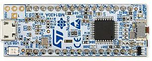
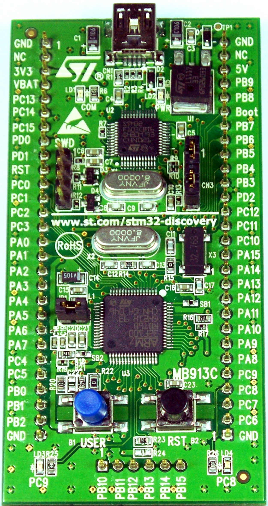
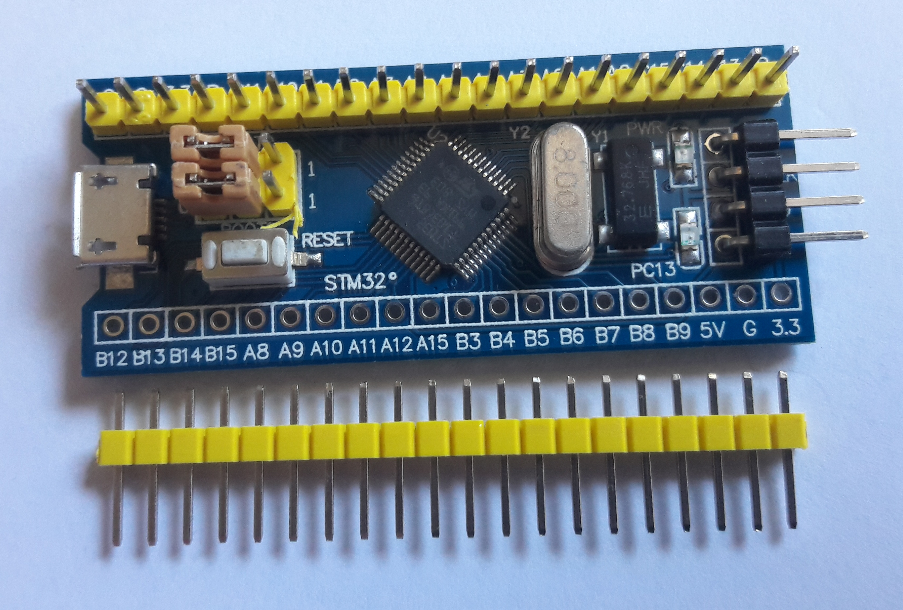
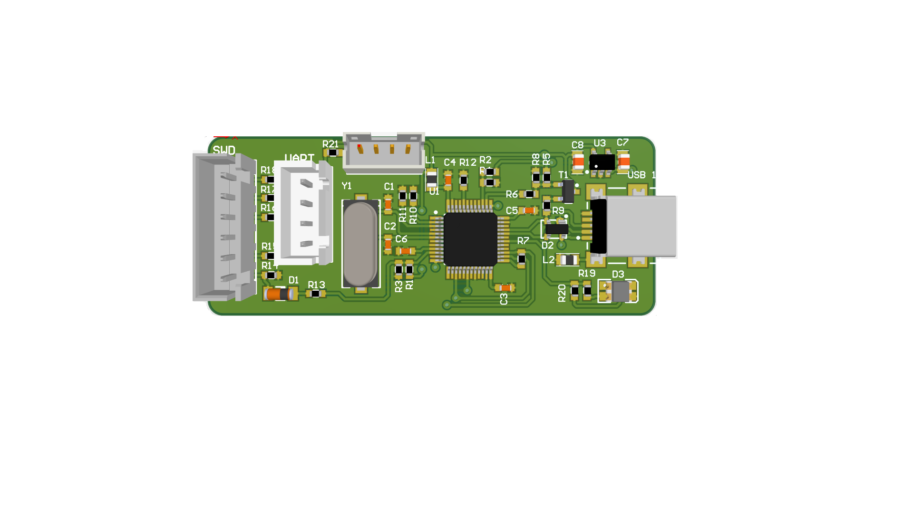
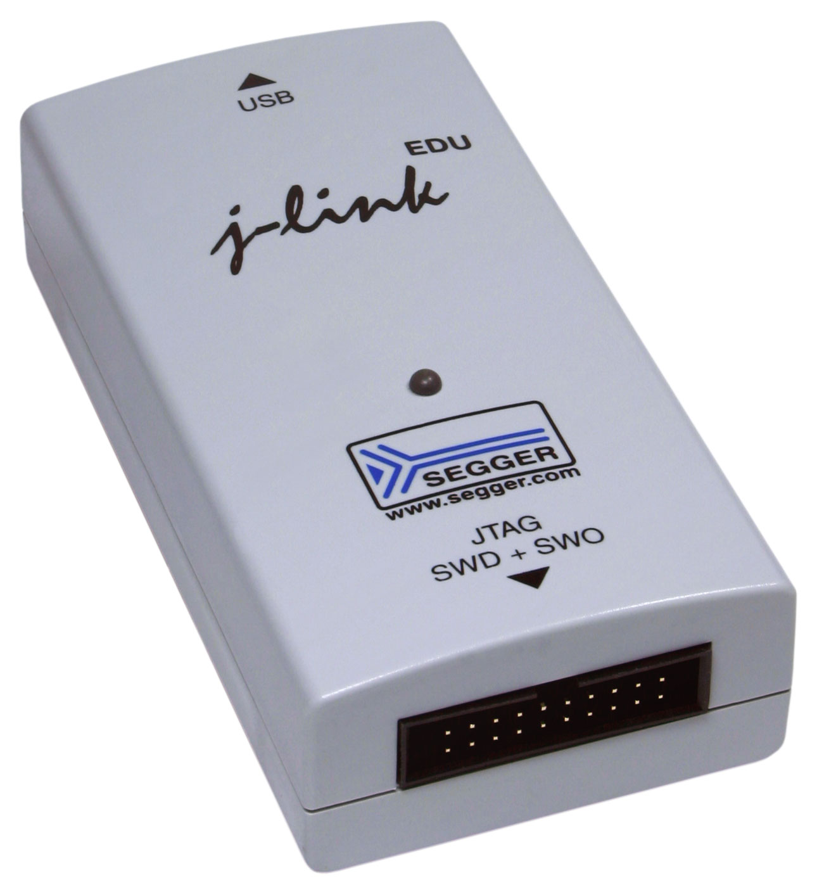

# Introdução ao Desenvolvimento de Software Embarcado

Até aqui vimos arquitetura de computadores de forma bastante geral. Antes de começar a programar de verdade, vale entender o que muda especificamente quando o alvo é um **microcontrolador** — e por que o processo de desenvolvimento para ele é estruturalmente diferente do que você já está acostumado ao programar para o seu próprio computador.

## O que tem dentro de um microcontrolador ARM

Um microcontrolador (MCU) baseado em ARM Cortex-M não é só "um processador" — é um **sistema completo em um único chip** (*System on Chip*, SoC), reunindo:

* o **núcleo do processador** (o Cortex-M propriamente dito — a ULA, a Unidade de Controle, o banco de registradores que já vimos);
* **memória Flash** (não-volátil, guarda o programa) e **SRAM** (volátil, guarda dados em execução), ambas internas ao próprio chip;
* diversos **periféricos** integrados — GPIO, temporizadores, conversores A/D, interfaces de comunicação (UART, SPI, I2C) — cada um endereçável como uma região de memória, exatamente como vimos no modo de endereçamento indexado;
* um **barramento interno** conectando tudo isso (o motivo de existirem os prefixos AHB/APB que veremos no Módulo 2).

Isso contrasta com um computador de propósito geral, onde processador, memória e periféricos são componentes fisicamente separados, conectados por barramentos externos na placa-mãe. No microcontrolador, tudo mora dentro do mesmo encapsulamento — o que é exatamente a razão de sistemas embarcados conseguirem ser tão compactos e baratos.

## O que você precisa para começar

Para desenvolver software para um microcontrolador, três peças de hardware/software são indispensáveis: uma **placa de desenvolvimento**, um **adaptador de depuração**, e o **driver de software** correspondente. Vamos ver cada uma.

### Placas de desenvolvimento

Uma placa de desenvolvimento (*development board*, ou simplesmente *kit*) traz o microcontrolador já montado, junto com regulador de tensão, cristal oscilador, conector USB, e geralmente um LED e um botão para os primeiros testes — tudo que você precisa para energizar o chip e começar a gravar código, sem ter que soldar nada.

Fabricantes de microcontroladores costumam oferecer várias famílias de placas, com propósitos diferentes:

::: {.content-card}
::: {.grid}
::: {.g-col-12 .g-col-md-4 .text-center}
{width="100%"}
:::
::: {.g-col-12 .g-col-md-8}
#### Nucleo (ST) {.unnumbered}

Linha de placas de baixo custo da ST, voltada a prototipagem rápida. Já vem com o adaptador de depuração **ST-LINK integrado** na própria placa (não precisa de um separado), e pinagem compatível com conectores Arduino (Uno) — o que facilita usar *shields* prontos. Existe uma Nucleo para praticamente cada linha da ST (F0, F1, F4, L4, G0...).
:::
:::
:::

::: {.content-card}
::: {.grid}
::: {.g-col-12 .g-col-md-4 .text-center}
{width="100%"}
:::
::: {.g-col-12 .g-col-md-8}
#### Discovery (ST) {.unnumbered}

Linha voltada à demonstração de recursos específicos do chip — costuma trazer periféricos extras na própria placa (acelerômetro, display, codec de áudio), também com adaptador de depuração integrado. Mais cara que a Nucleo, mas útil quando o periférico embutido é relevante para o seu projeto.
:::
:::
:::

::: {.content-card}
::: {.grid}
::: {.g-col-12 .g-col-md-4 .text-center}
{width="100%"}
:::
::: {.g-col-12 .g-col-md-8}
#### Blue Pill / Black Pill (placas "genéricas") {.unnumbered}

Placas minimalistas, fabricadas por terceiros (não pela ST) a partir de projetos abertos — **não trazem** adaptador de depuração integrado, o que exige comprar um separado. Em compensação, custam uma fração do preço de uma Nucleo/Discovery. A **Blue Pill** usa o STM32F103 (Cortex-M3); a **Black Pill**, que usaremos neste curso, usa o STM32F401/F411 (Cortex-M4).
:::
:::
:::

### Adaptadores de depuração

O adaptador de depuração (*debug adapter* ou *debug probe*) é a interface física — via protocolo **SWD** (*Serial Wire Debug*, 2 fios) ou **JTAG** (mais fios, mais antigo) — que permite ao seu computador gravar o programa na Flash do microcontrolador e inspecionar registradores/memória durante a execução.

::: {.content-card}
::: {.grid}
::: {.g-col-12 .g-col-md-4 .text-center}
{width="100%"}
:::
::: {.g-col-12 .g-col-md-8}
#### ST-LINK/V2 {.unnumbered}

O adaptador padrão da ST, usado nas Nucleo/Discovery (integrado) e vendido separadamente como um pequeno dongle USB — inclusive em versões **clone** (não-oficiais, fabricadas por terceiros), vendidas por poucos dólares em lojas como AliExpress e Mercado Livre. Para uma placa "genérica" como a Black Pill, que não traz debug adapter embutido, esse é o acessório mais comum e barato do mercado — e o que usaremos neste curso.
:::
:::
:::

::: {.content-card}
::: {.grid}
::: {.g-col-12 .g-col-md-4 .text-center}
{width="100%"}
:::
::: {.g-col-12 .g-col-md-8}
#### J-Link (Segger) {.unnumbered}

Linha profissional de adaptadores de depuração, compatível com praticamente qualquer chip ARM (não só STM32). Muito mais robusta e rápida que o ST-LINK, com suporte a recursos avançados de depuração — mas também muito mais cara: a versão profissional custa centenas de dólares. A Segger oferece uma versão **EDU**, com licença para uso educacional/não-comercial a um preço bem mais acessível. Não é necessária para este curso, mas é a ferramenta que você provavelmente vai encontrar em um ambiente profissional.
:::
:::
:::

::: {.callout-note title="Kit oficial do curso e alternativas"}
Utilizaremos a **STM32F411 Black Pill** + um **adaptador ST-LINK/V2** (clone) como kit oficial do curso — a combinação mais barata e amplamente disponível para um núcleo Cortex-M4 completo.

Se você já possui outra placa, ou preferir adquirir uma diferente, **qualquer kit baseado em Cortex-M3 ou Cortex-M4** é aceito neste curso — Nucleo, Discovery, Blue Pill, ou qualquer outra. Os conceitos e o processo de desenvolvimento que vamos aprender são os mesmos, independente do kit específico — só alguns detalhes de mapa de memória e periféricos vão variar, e isso fica por sua conta ajustar consultando o *datasheet* do seu chip. Se optar por uma Nucleo/Discovery, você já tem o debug adapter embutido — não precisa comprar um ST-LINK separado.
:::

Por fim, o **driver de software**: para o sistema operacional reconhecer o adaptador de depuração como um dispositivo USB válido. Isso já foi resolvido no roteiro de Ambiente e Ferramentas (seção de acesso a dispositivos USB no WSL2).

## Cross-Development: por que é diferente de programar para o seu PC

Quando você compila um programa para rodar no seu próprio computador, o compilador gera código para a **mesma arquitetura** da máquina que está compilando — você compila e executa no mesmo lugar. Esse é o desenvolvimento **nativo**.

No desenvolvimento embarcado, isso não é possível: o microcontrolador não tem capacidade (nem sentido) de rodar um compilador, um editor de texto, ou qualquer ferramenta de desenvolvimento. Por isso, usamos **desenvolvimento cruzado** (*cross-development*):

* o **host** é a sua máquina (x86_64), onde você edita o código e roda o compilador;
* o **target** é o microcontrolador (ARM Cortex-M), que só recebe o binário já pronto;
* o compilador que gera código para uma arquitetura diferente da que está rodando é chamado de **compilador cruzado** (*cross-compiler*) — no nosso caso, o `arm-none-eabi-gcc` que já instalamos no roteiro de Ambiente e Ferramentas.

O fluxo típico de trabalho, em qualquer projeto embarcado sério (com ou sem IDE), segue sempre o mesmo ciclo:

1. **Editar** o código-fonte (no host);
2. **Compilar** com o cross-compiler, gerando um binário para o target;
3. **Gravar** (*flash*) o binário na memória Flash do microcontrolador, via debug adapter;
4. **Depurar/testar** — rodar o programa no hardware real e, se necessário, usar o debug adapter para inspecionar registradores/memória durante a execução;
5. Repetir a partir do passo 1.

Esse ciclo é o mesmo, seja você usando uma IDE comercial (Keil, IAR) ou, como faremos neste curso, apenas o VS Code com o GCC — a diferença é que, nas IDEs comerciais, boa parte disso acontece por trás de botões, enquanto aqui você vai executar (e entender) cada etapa manualmente.

::: {.callout-tip}
O primeiro projeto prático real que faremos no curso — piscar o LED da placa ("Blinky") compilando com `arm-none-eabi-gcc` e um `Makefile` escrito à mão — é literalmente o exemplo padrão usado na literatura de referência da área para introduzir esse fluxo de trabalho. Não é uma simplificação nossa: é como profissionais da indústria validam um ambiente de desenvolvimento novo, em qualquer microcontrolador.
:::

## Recapitulando: por que ARM Cortex-M, e por que não Arduino/ESP32?

Você já viu, de ângulos diferentes, por que este curso é construído em torno da arquitetura ARM Cortex-M — pela [história e comparação Load-Store da arquitetura](arquitetura-computadores.qmd#cisc-vs.-risc), e pelo [panorama de plataformas na Apresentação](../index.qmd#arquitetura-e-plataformas-para-sistemas-embarcados). Agora que você está prestes a configurar o ambiente e escolher/confirmar seu kit, vale fechar essa discussão de forma direta, com o fluxo de desenvolvimento que acabamos de descrever em mente.

**Arduino (AVR) e ESP32 (Xtensa) são ferramentas legítimas e amplamente usadas** — não estamos dizendo que são ruins. O problema, para os fins deste curso, é que seus ambientes de desenvolvimento (Arduino IDE, framework Arduino-ESP32) **escondem exatamente as cinco etapas que acabamos de descrever**: você aperta "Upload" e tudo acontece nos bastidores — o `arm-none-eabi-gcc` (ou equivalente) é chamado automaticamente, o binário é gravado sem você escolher como, e não existe visibilidade nenhuma sobre o que está na memória antes do seu `setup()`/`loop()` começar a rodar.

Isso é uma escolha de design deliberada e válida dessas plataformas — elas priorizam produtividade e uma curva de aprendizado suave. Mas é o oposto do que este curso se propõe a ensinar. Aqui, você vai:

* escrever o próprio `Makefile`, entendendo exatamente qual comando compila, qual linka, qual grava;
* escrever o próprio `startup.c` e *linker script*, entendendo o que existe na memória antes do `main()`;
* usar o adaptador de depuração diretamente, sem uma IDE escondendo o processo.

O ganho não é filosófico — é prático: esse conhecimento é **diretamente portável** para qualquer microcontrolador ARM, de qualquer fabricante (ST, NXP, TI, Nordic...), com ou sem framework de alto nível no meio do caminho. Quem sabe configurar esse ambiente do zero consegue debugar quando algo dá errado — quem só sabe apertar "Upload" fica travado no primeiro problema que a IDE não resolve sozinha.

## Próximos passos

Com o kit em mãos (ou a caminho) e o conceito de cross-development claro, o próximo passo é configurar o ambiente de desenvolvimento na prática — isso é o assunto do próximo capítulo, **Ambiente e Ferramentas de Desenvolvimento**, que você deve completar antes da próxima aula.

## Referências

[1] Yiu, J. *The Definitive Guide to ARM® Cortex®-M3 and Cortex®-M4 Processors*, 3rd Edition. Newnes, 2013. Capítulos 2 (*Introduction to Embedded Software Development*) e 17 (*Getting Started with the GNU Compiler Collection (gcc)*).
